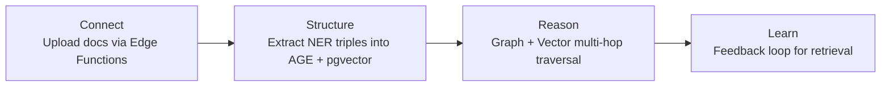
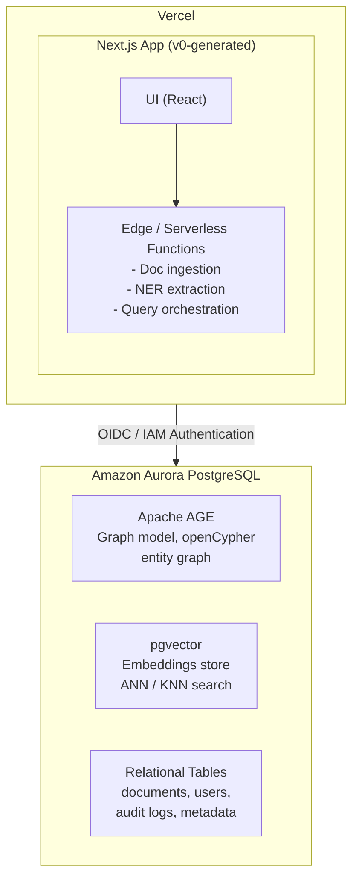

# EnterpriseIQ — AI-Powered Enterprise Knowledge Graph Platform

EnterpriseIQ is a **GraphRAG platform** that turns fragmented enterprise knowledge into a queryable, AI-native knowledge graph — a true **"Company Brain"** for autonomous AI agents. Instead of standard vector RAG that struggles with multi-hop reasoning, EnterpriseIQ combines `pgvector` and `Apache AGE` on Amazon Aurora PostgreSQL to deliver accurate, explainable, auditable answers across siloed company data.

Built for the **H0: Hack the Zero Stack** hackathon (Track 4: Open Innovation).

## The Problem

### Fragmented Enterprise Knowledge ("Company Brain")

Enterprise knowledge is scattered across emails, Slack, PDFs, CRMs, and unwritten tribal knowledge. Y Combinator identifies building a **"Company Brain"** — a unified reasoning layer over siloed organizational data — as one of the most critical infrastructure needs in their Request for Startups.

Standard RAG systems fail at questions requiring multi-hop reasoning:

> *"How did the VIP refund policy change after Q3, and who approved the final version?"*

Vector search alone cannot connect entities, traverse relationships, or produce auditable reasoning chains. AI agents hallucinate without a structured knowledge graph that models entities and their relationships.

| Retrieval Method | Mechanism | Core Limitation |
|---|---|---|
| **Lexical Search** | Exact string matching | Misses context and synonyms |
| **Standard RAG (Vector Search)** | Semantic similarity via vector distance | No relationship structure, cannot multi-hop reason |
| **GraphRAG (Knowledge Graph)** | Traverse entity nodes and edges | More complex extraction pipeline, but enables multi-hop reasoning with full audit trails |

### Regulatory & Compliance Burden

In regulated industries (pharma, healthcare, finance, real estate), compliance teams need absolute precision — not creative generation. Synthesizing thousands of clinical trial pages into CSR reports takes months, and every regulatory filing delay can cost **$45M/month** in lost revenue. Teams across time zones need to edit data concurrently without conflicts or sync issues.

### The Market Shift

The industry is moving from **AI wrappers** to **deep agentic workflows** inside enterprise systems. Legacy software designed for human operation breaks when AI agents need to interact with it.

## The Solution: GraphRAG

EnterpriseIQ implements a 4-step GraphRAG pipeline:



1. **Connect** — Documents are uploaded via Vercel Edge Functions
2. **Structure** — LLM extracts entity triples (Subject-Predicate-Object) and embeddings
3. **Reason** — openCypher traverses graph relationships + pgvector retrieves semantically similar nodes
4. **Learn** — User feedback improves future retrieval quality

## Architecture



### Key Design Decisions

| Decision | Choice | Rationale |
|----------|--------|-----------|
| **Database** | Aurora PostgreSQL | Unified graph + vector + relational in one engine |
| **Graph Engine** | Apache AGE | openCypher queries, no separate graph DB to operate |
| **Vector Search** | pgvector | Embeddings co-located with graph nodes |
| **Frontend** | Next.js on Vercel | Edge-deployed, v0-scaffolded |
| **Auth** | Vercel OIDC → AWS IAM | Passwordless, no static secrets in code |
| **Deployment** | Vercel Serverless | Auto-scaling, global edge network |

## Tech Stack

- **Frontend**: Next.js, React, Tailwind CSS (generated via v0.app)
- **Backend**: Vercel Edge Functions / Serverless Functions
- **Database**: Amazon Aurora PostgreSQL
- **Extensions**: `pgvector`, `Apache AGE`
- **Auth**: Vercel OIDC Federation + AWS IAM (`@aws-sdk/rds-signer`)
- **Infrastructure**: Vercel, AWS (via Vercel Marketplace integration)

## Getting Started

### Prerequisites

- Node.js 18+
- AWS account (or Vercel-provisioned account via Marketplace)
- Vercel account

### Setup

```bash
# Clone the repository
git clone https://github.com/your-org/enterpriseiq.git
cd enterpriseiq

# Install dependencies
npm install

# Set up environment variables
cp .env.example .env
# Fill in your AWS credentials / OIDC config

# Run development server
npm run dev
```

### Database Provisioning

Provision Aurora PostgreSQL through the Vercel Marketplace or AWS Console:

```bash
# Via Vercel CLI (recommended)
vercel integrate aws
# Select Aurora PostgreSQL and follow the wizard
```

Enable the required extensions:

```sql
CREATE EXTENSION IF NOT EXISTS vector;
CREATE EXTENSION IF NOT EXISTS age;
```

## Usage

1. **Ingest documents** — Upload PDFs, markdown, or connect Slack/email sources
2. **Ask complex questions** — e.g., "What is the refund policy for enterprise customers?"
3. **Explore the knowledge graph** — Visualize entity relationships in the graph explorer
4. **Get auditable answers** — Every response traces back to source documents and graph paths

## Project Status

This project was built for the **H0: Hack the Zero Stack** hackathon (June 2026). The architecture and research are documented in the `docs/` directory.

## License

MIT
